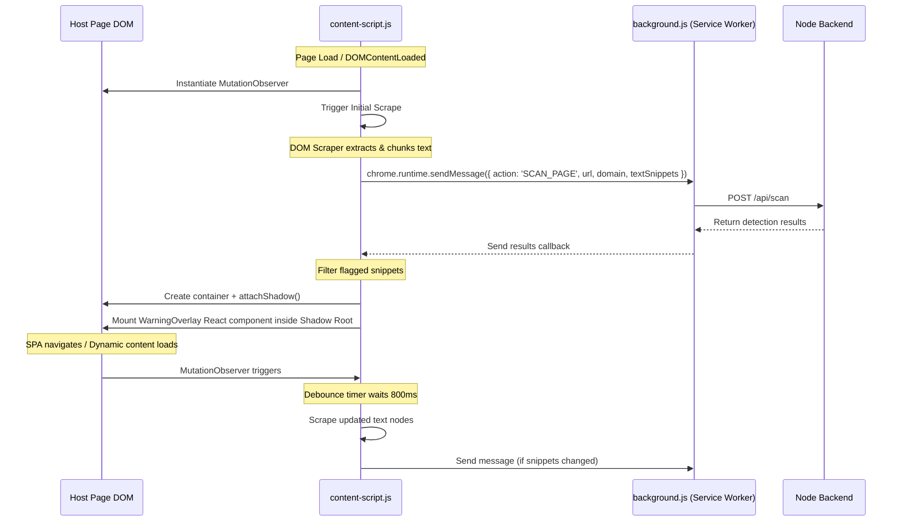

# Dark Pattern Detector - Frontend System Design

This document details the system architecture, component design, and data flows for the **Browser Extension** and **Web Dashboard** of the Dark Pattern Detector.

---

## 1. System Architecture

```mermaid
graph TB
    subgraph Browser Tab (Host Page)
        DOM[Host DOM]
        CS[content-script.js]
        SO[Shadow DOM Overlay]
    end

    subgraph Browser Extension Context
        BG[background.js Service Worker]
        PP[Popup.jsx React App]
    end

    subgraph Web Dashboard (App)
        DB[Dashboard React App]
        AC[AuthContext]
        AX[Axios Client Interceptor]
    end

    subgraph Backend Services
        BE[Node.js Express Backend]
        AI[Python FastAPI NLP Service]
    end

    %% Extension Connections
    DOM -->|MutationObserver & Scraper| CS
    CS -->|chrome.runtime.sendMessage| BG
    BG -->|fetch POST /api/scan| BE
    BE -->|analyzes text| AI
    BE -->|returns results| BG
    BG -->|message reply| CS
    CS -->|mounts React root| SO
    PP -->|chrome.storage.local| BG
    PP -->|read stats| BG

    %% Dashboard Connections
    DB --> AC
    DB --> AX
    AX -->|HTTP Requests with JWT| BE
```

---

## 2. Browser Extension Design

### 2.1 DOM Scraping & Change Detection Flow

To achieve high accuracy and minimal performance impact, the `content-script.js` uses a specialized scraper and a debounced mutation listener:



#### DOM Scraper Details
1. **Filtering Rules**: The scraper traverses the DOM using a recursive tree walker, omitting:
   - Script, style, iframe, svg, canvas, and noscript elements.
   - Elements with hidden attributes or styles (`display: none`, `visibility: hidden`, `opacity: 0`).
   - Inputs, textareas, and interactive buttons (unless they contain confirmshaming text).
2. **Text Chunking**: Instead of sending the entire page content as a single block, the text is extracted as snippets mapped to their closest DOM parent. This allows the overlay to point directly to the offending element.
3. **Debouncing**: Dynamic content loads can trigger hundreds of mutations. The scraper uses a sliding debounce window of **800ms** to wait until DOM updates settle before compiling and sending a scan request.

### 2.2 Extension Communication Protocol

All runtime messages between components follow a strict schema:

* **Scraper to Background Service Worker**
  ```typescript
  interface ScanRequestMessage {
    action: 'SCAN_PAGE';
    url: string;
    domain: string;
    textSnippets: string[];
  }
  ```

* **Background Service Worker to Scraper (Response)**
  ```typescript
  interface ScanResponseMessage {
    results: Array<{
      snippet: string;
      isDarkPattern: boolean;
      patternType: string; // e.g. "fake-urgency", "confirmshaming"
      confidence: number;
    }>;
    websiteRiskScore: number;
  }
  ```

* **Popup to Background Service Worker (State Sync)**
  ```typescript
  interface ToggleStateMessage {
    action: 'TOGGLE_DOMAIN';
    domain: string;
    enabled: boolean;
  }
  ```

### 2.3 Styling Isolation (Shadow DOM)

To ensure the warning overlays remain visually consistent regardless of the parent site's styling, they are injected inside a **Shadow Root**:

```
[Host Page Body]
  └── [div #dark-pattern-detector-overlay-container]
        └── #shadow-root (open)
              ├── [style] (reset-styles & variables)
              └── [WarningOverlay React Root]
```
- **Reset Styles**: Standard CSS selectors inside the Shadow Root override properties like `box-sizing`, `font-family`, `margin`, and `line-height` to prevent page stylesheet bleed-through.
- **Glassmorphism Theme**: Uses a premium, dark-mode scheme with a blur backdrop filter, translucent crimson borders, and vibrant warning tags.

---

## 3. Web Dashboard Design

### 3.1 Authentication & Axios Interceptor Architecture

The dashboard maintains security and session persistence using a dual-token strategy (JWT `accessToken` in memory, `refreshToken` in an HTTP-only cookie).

```mermaid
sequenceDiagram
    participant App as Dashboard Router / Component
    participant AX as Axios Client
    participant BE as Node Backend (Auth)

    App->>AX: Call API (e.g. getOverview)
    Note over AX: Interceptor attaches Bearer Token
    AX->>BE: GET /api/dashboard/overview (Header: Auth Token)
    
    ALT Token Valid
        BE-->>AX: 200 OK (Data)
        AX-->>App: Resolve Promise
    ALT Token Expired (401 Unauthorized)
        BE-->>AX: 401 Unauthorized
        Note over AX: Catch 401 in Response Interceptor
        Note over AX: Lock queue & trigger silent refresh
        AX->>BE: POST /api/auth/refresh (withCredentials: true)
        ALT Refresh Successful
            BE-->>AX: 200 OK (New accessToken)
            Note over AX: Update AuthContext with new token
            Note over AX: Replay queued original request with new token
            AX->>BE: GET /api/dashboard/overview (Header: New Auth Token)
            BE-->>AX: 200 OK (Data)
            AX-->>App: Resolve original Promise
        ALT Refresh Failed (401/403)
            BE-->>AX: 401 Unauthorized
            Note over AX: Clear AuthContext & redirect to /login
            AX-->>App: Reject Promise
        end
    end
```

### 3.2 Component and Routing Hierarchy

```
[App.jsx] (wraps everything in <AuthContext.Provider>)
  ├── <Navbar /> (shown on authenticated routes)
  └── [Router]
        ├── /login (Public Page)
        └── [RequireAuth] (Guard Component)
              ├── /overview (Overview.jsx)
              │     ├── <TrendsLineChart />
              │     └── <PatternTypeBarChart />
              ├── /history (History.jsx)
              │     └── <FilterBar /> + <Pagination />
              └── /website-scores (WebsiteRiskScores.jsx)
```

---

## 4. Complete Directory Mapping

The codebase folders are populated as follows:

```
extension/
├── manifest.json
├── package.json
├── vite.config.js
├── index.html
├── src/
│   ├── background.js              # Service worker: fetches /api/scan, manages badge icon
│   ├── content-script.js          # DOM crawler, MutationObserver, Shadow DOM injector
│   ├── popup/
│   │   ├── main.jsx               # Popup bundle entrypoint
│   │   ├── Popup.jsx              # Popup React dashboard & control panel
│   │   └── Popup.css              # Glassmorphic extension popup styling
│   └── components/
│       └── WarningOverlay.jsx     # Shadow DOM warning overlay
└── public/
    └── icons/                     # Extension branding icons

dashboard/
├── package.json
├── vite.config.js
├── index.html
├── src/
│   ├── index.css                  # Typography, variables, dark theme base
│   ├── main.jsx                   # React bootstrapper
│   ├── App.jsx                    # Routing table & context wrappers
│   ├── api/
│   │   ├── client.js              # Token refresh interceptor & Axios configuration
│   │   ├── auth.api.js            # Authentication endpoints
│   │   └── dashboard.api.js       # Metrics & history endpoints
│   ├── context/
│   │   └── AuthContext.jsx        # JWT credentials provider
│   ├── routes/
│   │   └── RequireAuth.jsx        # Authorization wall
│   ├── components/
│   │   ├── Navbar.jsx             # Frosty navigation bar
│   │   └── Charts/
│   │       ├── TrendsLineChart.jsx     # Trends line visualizer (Recharts)
│   │       └── PatternTypeBarChart.jsx  # Category breakdown chart (Recharts)
│   └── pages/
│       ├── Login.jsx              # Cyberpunk dashboard entrance
│       ├── Overview.jsx           # Cards, activity stream, charts
│       ├── History.jsx            # Query-string synced detection table
│       └── WebsiteRiskScores.jsx  # Leaderboard of suspicious domains
```
